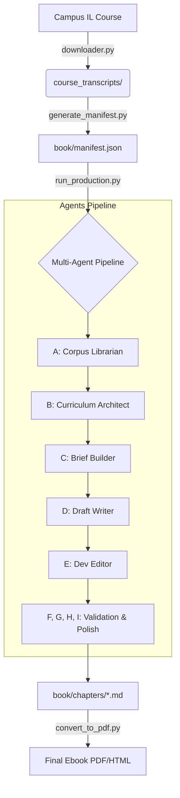

# 📜 Scripts Overview: Viruses Campus IL Full Course

This document provides a comprehensive map of the automation scripts in this repository. It explains what each script does, how they work together, and the overall data flow of the **Hebrew Virology Ebook Production Pipeline**.

---

## 🏗️ High-Level System Architecture

The project follows a **Source → Agents → Artifact** flow.

---

## 🚀 Orchestration & Entry Points

These scripts are the main controllers that you run to trigger the pipeline.

| Script | Purpose | How it Works |
| :--- | :--- | :--- |
| `run_production.py` | **Main Production Entry** | Orchestrates Agents A-I using the `PipelineOrchestrator`. It manages sequential dependencies and parallel execution. |
| `run_optimized_pipeline.py` | **Performance-Oriented Runner** | Uses a shared `PipelineContext` to cache data across agents, reducing redundant file I/O and API calls. |
| `main.py` | **Legacy/Transcripts Ingest** | Primary entry point for downloading transcripts from the Campus IL platform. |
| `run_full_pipeline.py` | **End-to-End Test** | A wrapper that often runs ingestion, manifest generation, and a subset of agents for testing. |

---

## 🤖 The Multi-Agent System (`agents/`)

These agents represent the "editorial staff" of the project.

| Agent | Module | Role |
| :--- | :--- | :--- |
| **Agent A** | `agent_a_corpus_librarian.py` | Scans the `course_transcripts/` folder, cleans text, and catalogs all sources. |
| **Agent B** | `agent_b_curriculum_architect.py` | Groups transcripts into logical chapters and defines learning objectives. |
| **Agent C** | `agent_c_brief_builder.py` | Generates detailed technical briefs (outlines) for the writer to follow. |
| **Agent D** | `agent_d_draft_writer.py` | **The Writer.** Converts transcripts into academic Hebrew prose. |
| **Agent E** | `agent_e_dev_editor.py` | Reviews the draft for pedagogical flow, tone, and clarity. |
| **Agent F** | `agent_f_assessment.py` | Generates multiple-choice and open-ended exam-prep questions. |
| **Agent G** | `agent_g_terminology.py` | Ensures scientific terms (DNA, RNA, etc.) are used consistently project-wide. |
| **Agent H** | `agent_h_proofreader.py` | Performs final grammar, spelling, and RTL (Right-to-Left) formatting checks. |
| **Agent I** | `agent_i_safety.py` | Scans for unsafe lab protocols or misinformation. |

### 🛠️ Agent Framework Support

* **`pipeline_orchestrator.py`**: Manages the "Stages" of the pipeline (e.g., Analysis → Design → Writing → Validation).
* **`pipeline_context.py`**: A shared "Blackboard" where agents store and retrieve cached files (e.g., Chapter Plans, Glossary).
* **`llm_client.py`**: A unified interface for interacting with Gemini Pro and other providers via OpenRouter.
* **`version_manager.py`**: Tracks revisions of Markdown files, providing a `git status`-like view of the book's progress.

---

## 📥 Data Extraction & Ingestion (`src/`)

These scripts handle the "raw materials."

* **`downloader.py`**: Uses Playwright to automate logging into Campus IL and clicking through lecture units to download `.txt` transcripts.
* **`extract.py`**: Utilities for parsing specific metadata (Lecture Index, Unit URLs) from the course HTML.
* **`ingest.py`**: Cleans raw transcript text (removes timestamps, identifies speakers).
* **`generate_manifest.py`**: Scans the directory and maps every transcript file to a chapter in `book/manifest.json`.

---

## 📄 Content Conversion & Formatting

Once the agents have written the Markdown, these scripts produce the final deliverables.

* **`convert_to_pdf.py`**: Converts Markdown to PDF (often using `pandoc` or `weasyprint`).
* **`convert_to_html.py`**: Generates a web-ready version of the Hebrew ebook.
* **`separate_answers.py`**: A utility that takes the generated practice questions and moves the answer key to a separate file for students.

---

## 🔍 Utilities & Validation

* **`verify_*.py`**: A suite of health-check scripts to ensure:
  * `verify_login.py`: Playwright can still log into the course.
  * `verify_bulk_download.py`: Check if any transcripts were missed during scraping.
  * `verify_env.py`: All required API keys and environment variables are set.
* **`debug_selectors.py`**: Used by developers to fix CSS selectors when the Campus IL website UI changes.

---

## 🛠️ Typical Workflow

1. **Extract Data**: `python main.py` (Downloads transcripts).
2. **Organize**: `python generate_manifest.py` (Mapps them to chapters).
3. **Produce**: `python run_production.py` (Agents write the book).
4. **Polish**: Review `book/chapters/` and `ops/todos.md`.
5. **Build**: Run `BOOK_DIR/build_all.sh` (or conversion scripts) to get the final PDF.

---

> [!NOTE]
> Most scripts use `ops/` for temporary artifacts and logs. If a script fails, check `ops/pipeline.jsonl` for a detailed trace of what each LLM agent was thinking.
